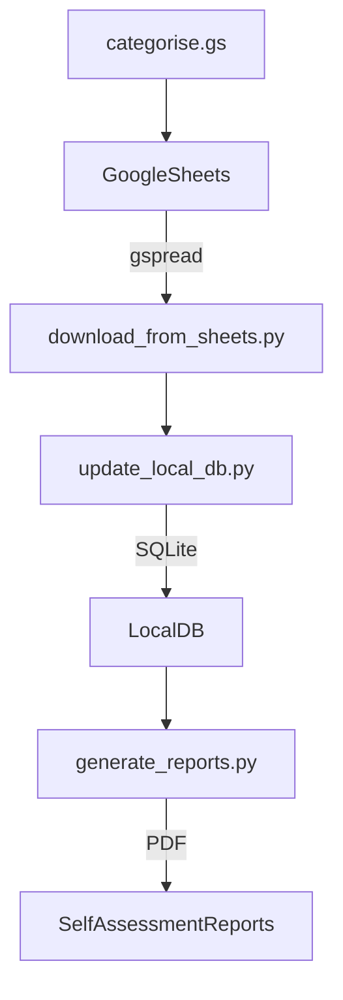

# Our Finances

Keeping track of the household budget

Personal finance management and HMRC self-assessment toolchain for a multi-account Google Sheets setup.

Includes:

- Google Sheets sync (via gspread)
- Transaction categorisation
- Local SQLite storage
- Tax and finance reports
- GAS menu helpers

## 🧩 Layout Diagram

You can generate visual diagrams using VS Code extensions like:

- "Project Tree Generator" (ASCII-style tree views)
- "Markdown Preview Mermaid Support" (for Mermaid diagrams)
- "Draw.io Integration" (GUI diagrams)

## download-our-finances

Python repository

[SQLAlchemy tutorial](https://docs.sqlalchemy.org/en/20/tutorial/metadata.html)

VS Code extensions:
Black Formatter by Microsoft

pwl is my own script to run Python With Logging

Test the Python connection to the Google spreadsheet
pwl key_check

All database fields are text to start with, except primary key id fields which are int
pwl spreadsheet_to_database

pwl vacuum our_finances.sqlite

sqlitebrowser our_finances.sqlite >sqlitebrowser.log 2>sqlitebrowser_error.log &

Prefer Numeric(10,2) over Float for financial data, map to Python as Decimal type

make install_hatch_plugin PLUGIN=hatch-vcs

sudo -v && curl https://rclone.org/install.sh | sudo bash
