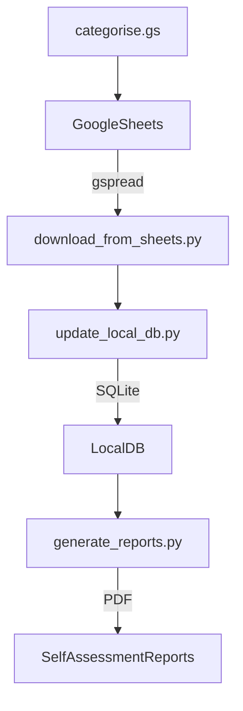

our-finances/
├── .vscode/                         # VS Code settings and config
│   └── settings.json               # Python interpreter and linting setup
├── config/                         # Metadata and rule definitions
│   ├── accounts.yaml              # Mapping account codes to owners
│   └── categories.yaml            # Categorisation rules
├── data/                           # Data inputs and outputs
│   ├── raw/                       # Optional cached Google Sheets exports
│   └── processed/                 # Cleaned data or local SQLite database
├── notebooks/                      # Jupyter notebooks for ad hoc exploration
│   └── analysis.ipynb            # Data insights, charts, etc.
├── reports/                        # Generated tax and finance reports
│   └── README.md
├── scripts/                        # CLI-level scripts for operations
│   ├── download_from_sheets.py   # Google Sheets to local
│   ├── update_local_db.py        # Populate SQLite from downloaded data
│   ├── generate_reports.py       # Build PDFs for tax, spending
│   └── sync_counterparties.py    # Reconcile inter-account transactions
├── sheets/                         # Apps Script code for menu and automation
│   ├── menu.gs                   # Custom menu entries
│   └── categorise.gs             # Optional rule-based categorisation
├── src/                            # Python source logic (importable as package)
│   └── finances/
│       ├── __init__.py
│       ├── loader.py             # Data fetching/parsing logic
│       ├── categories.py         # Category assignment functions
│       ├── balance_check.py      # Sanity and reconciliation checks
│       └── reports.py            # Generate report content/data
├── tests/                          # Pytest tests
│   └── test_categories.py
├── .gitignore                      # Ignore venv, .env, data, etc.
├── requirements.txt                # pip dependencies
├── pyproject.toml                  # Formatting, linting, tool config
└── README.md                       # Project overview and usage

# Example content for key files

# .vscode/settings.json
{
  "python.pythonPath": "venv/bin/python",
  "python.formatting.provider": "black",
  "python.linting.flake8Enabled": true,
  "python.testing.pytestEnabled": true
}

# config/accounts.yaml
BMOXYZ:
  name: "Barclays Main Account"
  owner: "Ian"
  active: true

# config/categories.yaml
Rent:
  - "rent received"
  - "tenant payment"
Interest:
  - "interest"
  - "savings income"

# scripts/download_from_sheets.py
from src.finances.loader import download_sheet_data

def main():
    download_sheet_data("Our Finances")

if __name__ == "__main__":
    main()

# src/finances/loader.py
def download_sheet_data(spreadsheet_name):
    print(f"Downloading data from {spreadsheet_name}...")
    # Stub for gspread logic

# src/finances/categories.py
def classify_transaction(note, rules):
    for category, patterns in rules.items():
        if any(p.lower() in note.lower() for p in patterns):
            return category
    return "Uncategorised"

# tests/test_categories.py
from src.finances.categories import classify_transaction

def test_classify_transaction():
    rules = {"Rent": ["rent", "tenant"], "Interest": ["interest"]}
    assert classify_transaction("Tenant Payment", rules) == "Rent"
    assert classify_transaction("Bank Interest", rules) == "Interest"
    assert classify_transaction("Other", rules) == "Uncategorised"

# requirements.txt
gspread
pandas
pyyaml
jinja2
pytest

# pyproject.toml
[tool.black]
line-length = 88

[tool.isort]
profile = "black"

# README.md
# Our Finances

Personal finance management and HMRC self-assessment toolchain for a multi-account Google Sheets setup.

Includes:
- Google Sheets sync (via gspread)
- Transaction categorisation
- Local SQLite storage
- Tax and finance reports
- GAS menu helpers

## 🧩 Layout Diagram
You can generate visual diagrams using VS Code extensions like:
- "Project Tree Generator" (ASCII-style tree views)
- "Markdown Preview Mermaid Support" (for Mermaid diagrams)
- "Draw.io Integration" (GUI diagrams)

Example Mermaid diagram (put in README.md or a `.md` file):

